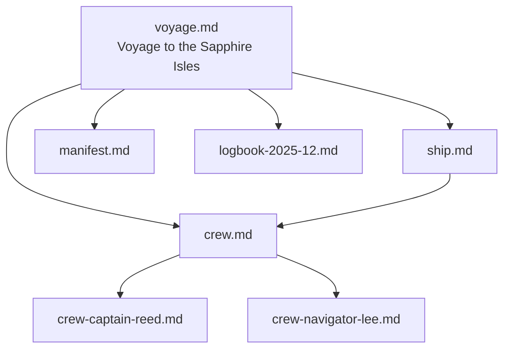

# Yurtle — YAML front matter that turns Markdown into a living graph

**Yurtle** = the simplest way to make every `.md` file in a folder part of a real, queryable knowledge graph.

Just add a normal YAML block at the top of any Markdown file.  
That's it.

```yaml
---
yurtle: v1.2
id: nautical/voyage
type: voyage
title: The Crossing of the Western Sea
path: nautical
index:
  discoverable: true
  parent: nautical
  children:
    - nautical/ship
    - nautical/crew
nugget: A three-month voyage to chart the uncharted archipelago
---
```

No plugins. No database. Works with Obsidian, Logseq, plain Git, or any future AI memory system.

---

## The Three-Layer Semantic Model

Yurtle pages express relationships through three complementary layers:

```
┌─────────────────────────────────────────────────────┐
│  Layer 1: FRONTMATTER (YAML header)                 │
│  ─────────────────────────────────────────────────  │
│  Explicit, machine-readable metadata                │
│  - id, type, title, nugget                          │
│  - relates-to: [list of related pages]              │
│  - index: { parent, children, discoverable }        │
└─────────────────────────────────────────────────────┘
                        │
                        ▼
┌─────────────────────────────────────────────────────┐
│  Layer 2: CONTENT BODY (Markdown)                   │
│  ─────────────────────────────────────────────────  │
│  Human-readable prose with implicit relationships   │
│  - Prose explanations                               │
│  - [[wiki-links]] to other pages                    │
│  - Code examples, procedures                        │
│  - Natural language parseable by LLMs               │
└─────────────────────────────────────────────────────┘
                        │
                        ▼
┌─────────────────────────────────────────────────────┐
│  Layer 3: INFOBOXES (Structured blocks)             │
│  ─────────────────────────────────────────────────  │
│  Wikipedia-style relationship declarations          │
│  - Appear anywhere in content                       │
│  - Declare typed relationships inline               │
│  - Enable "graph anywhere" pattern                  │
└─────────────────────────────────────────────────────┘
```

### Why Three Layers?

- **Frontmatter**: Document-level metadata, always at top
- **Content**: Natural language, human-readable
- **Infoboxes**: Structured data at any point in the document

This is the **"graph anywhere"** principle — relationships are declared where they make sense, not in a separate database.

---

## Core Fields (v1.2)

```yaml
---
yurtle: v1.2
id: unique/uri/like/this          # required - unique identifier
type: note | person | voyage | ship | project | log | ...
title: Human Readable Name
status: draft | active | complete | archived
topics: [list, of, tags]
relates-to: [other/id, another/id]
nugget: One-sentence essence (for search results)
created: 2025-12-01
---
```

### Hierarchy & Discovery

```yaml
path: folder/location             # e.g. expeditions/001 or crew
index:
  discoverable: true|false        # default true - include in indexes
  parent: id-or-path              # container/parent node
  children:                       # what lives inside this file
    - child-id-1
    - child-id-2
```

### Evolution & Domain (for long-lived concepts)

```yaml
domain:
  - motivation
  - sustainability
  - your-custom-domain

evolves:
  - previous-id                   # what this replaces/improves
  score: 0.91                     # confidence (0-1)
  reason: Added new properties

version: 1.3.0                    # SemVer for versioned assets
```

---

## Layer 3: Infoboxes

Infoboxes are structured blocks that can appear **anywhere** in a page's content. They follow the "graph anywhere" principle.

### Basic Syntax

```markdown
<!-- infobox:type-name -->
| Property | Value |
|----------|-------|
| Key1 | Value1 |
| Key2 | Value2 |
<!-- /infobox -->
```

### Examples

**Ship Infobox:**
```markdown
<!-- infobox:ship -->
| Property | Value |
|----------|-------|
| Name | Windchaser |
| Type | Clipper |
| Built | 1852 |
| Length | 62m |
| Captain | Captain Reed |
<!-- /infobox -->
```

**Relationship Infobox:**
```markdown
<!-- infobox:relationships -->
| Relationship | Target | Notes |
|--------------|--------|-------|
| requires | crew.md | Minimum 20 souls |
| uses | manifest.md | Cargo tracking |
| part-of | voyage.md | Current expedition |
<!-- /infobox -->
```

**Person Infobox:**
```markdown
<!-- infobox:person -->
| Property | Value |
|----------|-------|
| Name | Captain Elias Reed |
| Role | Master & Commander |
| Born | 1809 |
| Years at Sea | 43 |
<!-- /infobox -->
```

### Why Infoboxes?

1. **Graph-Anywhere**: Declare relationships at any point in content
2. **Human-Readable**: Looks like Wikipedia infoboxes
3. **Machine-Parseable**: Easy for tools and LLMs to extract
4. **Flexible**: Add structured data without changing frontmatter

---

## LLM-Native Design

Yurtle is designed for AI-first workflows:

- **No query language needed** — LLMs read markdown naturally
- **Relationships in context** — Infoboxes appear near relevant content
- **Human-readable** — Works for humans and AIs simultaneously
- **Git-native** — Version control built in

Example LLM interaction:
```
User: What ships are in the fleet?

LLM: *reads voyage.md frontmatter*
     *finds relates-to: [ship.md]*
     *reads ship.md, finds infobox:ship*
     
     The fleet contains the Windchaser, a 62m clipper built in 1852,
     captained by Elias Reed.
```

---

## Demo: The Windchaser Project

**See the canonical demo** → [`examples/nautical-project/index.md`](examples/nautical-project/index.md)

A fully-populated knowledge graph: one voyage, one ship, crew members, a manifest, and a logbook.



---

## Version History

| Version | Date | Changes |
|---------|------|---------|
| v1.2 | Dec 2025 | Three-layer model, infoboxes, graph-anywhere |
| v1.1 | Dec 2025 | Hierarchy & discovery (index, parent, children) |
| v1.0 | Nov 2025 | Initial release (frontmatter basics) |

---

MIT licensed · Fork, extend, build your own fleet.

*"I'm Yurtle the Turtle! Oh, marvelous me! For I am the ruler of all that I see!"*
