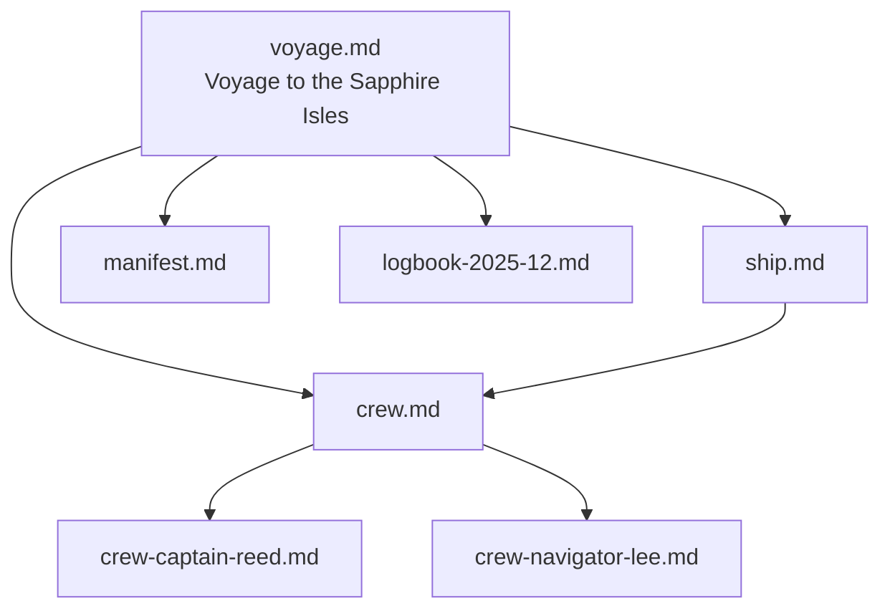

# Yurtle — YAML front matter that turns Markdown into a living graph

**Yurtle** = the simplest way to make every `.md` file in a folder part of a real, queryable knowledge graph.

Just add a normal YAML block at the top of any Markdown file.  
That’s it.

```yaml
---
yurtle: v1.1
id: nautical/voyage
type: voyage
title: The Crossing of the Western Sea
path: nautical
index:
  discoverable: true
  parent: nautical
  children:
    - nautical/ship
    - nautical/crew
nugget: A three-month voyage to chart the uncharted archipelago
---
```

No plugins. No database. Works with Obsidian, Logseq, plain Git, or any future AI memory system...

### Core fields (recommended)
```yaml
yurtle: v1.1
id: unique/uri/like/this          # required
type: note | person | voyage | ship | ...
title: Human name
status: draft | active | sailing | docked
topics: [list, of, tags]
relates-to: [other/id, another/id]
nugget: One-sentence essence
created: 2025-12-01
```

### New in v1.1 — Hierarchy & Discovery
```yaml
path: folder/location             # e.g. expeditions/001 or crew
index:
  discoverable: true|false        # default true
  parent: id-or-path              # container
  children:                       # what lives inside this file
    - child-id-1
    - child-id-2
```
---

### New in v1.2 - Evolution & Domain fields (optional, encouraged for long-lived concepts)

domain:
  - motivation
  - tupugit
  - wonder
  # exact TLP tech-names or your own custom domains

evolves:
  - assets/motivation-v1.2.0
  score: 0.91
  reason: Added Pink autonomy/mastery/purpose sub-properties

version: 1.7.2        # SemVer – makes “current” unambiguous

---

Your folder structure becomes part of the graph. Tools can now auto-generate wikis, sitemaps, or Mermaid diagrams from nothing but Markdown + Yurtle.

**See the canonical demo** → [`examples/nautical-project/index.md`](examples/nautical-project/index.md)
A fully-populated, living knowledge graph — one voyage, one ship, several crew, a manifest, a logbook, and a clickable index. All relationships and hierarchy work out of the box. Fork it and adapt for your own project, campaign, or knowledge base.



MIT licensed · Fork, extend, build your own fleet.

## Add Documentation Section

Add a documentation section to the README explaining how to use the yurtle knowledge graph.

### Acceptance Criteria
- [x] README has a new section
- [x] Section explains yurtle usage
- [x] Contains at least 3 lines

---
*Completed by santiago-dev aboard ss-voyage*
*Task: TASK-001*
*Timestamp: 2025-12-02T04:29:40.136747*
