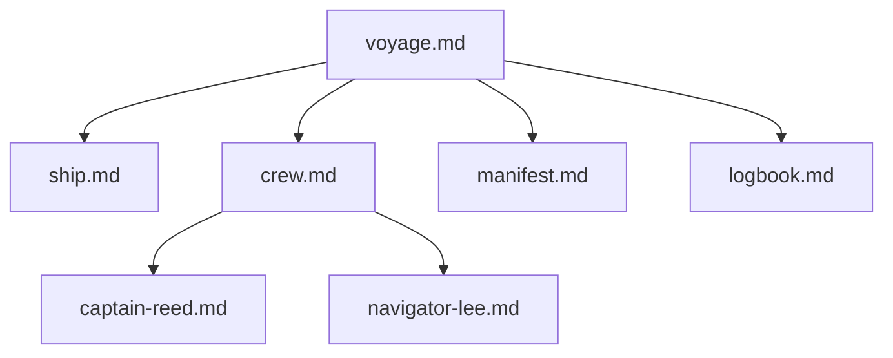

# Yurtle — YAML front matter that turns Markdown into a living graph

**Yurtle** = the simplest way to make every `.md` file in a folder part of a real, queryable knowledge graph.

Just add a normal YAML block at the top of any Markdown file.  
That's it.

```yaml
---
yurtle: v1.3
id: nautical/voyage
type: voyage
title: The Crossing of the Western Sea
relates-to:
  - nautical/ship
  - nautical/crew
nugget: A three-month voyage to chart the uncharted archipelago
---
```

No plugins. No database. Works with Obsidian, Logseq, plain Git, or any future AI memory system.

---

## The Three-Layer Semantic Model

Yurtle pages express relationships through three complementary layers:

| Layer | Where | Syntax | Purpose |
|-------|-------|--------|---------|
| **Frontmatter** | Top of file | `---` YAML `---` | Document metadata |
| **Content** | Body | Markdown + `[[links]]` | Human prose |
| **Yurtle Blocks** | Anywhere | ` ```yurtle ``` ` | Inline structured data |

This is the **"graph anywhere"** principle — relationships declared where they make sense.

---

## Layer 1: Frontmatter

```yaml
---
yurtle: v1.3
id: unique/uri/like/this
type: note | person | voyage | ship | project | ...
title: Human Readable Name
status: draft | active | complete
topics: [list, of, tags]
relates-to: [other/id, another/id]
nugget: One-sentence essence for search
created: 2025-12-01
---
```

### Hierarchy & Discovery

```yaml
path: folder/location
index:
  discoverable: true
  parent: parent-id
  children:
    - child-id-1
    - child-id-2
```

### Evolution & Domain

```yaml
domain: [nautical, logistics]
evolves:
  - previous-id
  score: 0.91
  reason: Added new properties
version: 1.3.0
```

---

## Layer 2: Content Body

Standard markdown with wiki-style links:

```markdown
The [[nautical/ship|Windchaser]] departed at dawn.
Captain [[nautical/crew-captain-reed|Reed]] took the helm.
```

LLMs can also extract relationships from prose:
- "The ship **depends on** a full crew" → `depends-on: crew`
- "This voyage **builds upon** the 1851 expedition" → `builds-upon: 1851-expedition`

---

## Layer 3: Yurtle Blocks

Structured data anywhere in your document, using familiar code fence syntax:

```markdown
# Windchaser

Built in Aberdeen, copper-sheathed, Baltimore clipper lines.

` ` `yurtle
ship:
  title: Windchaser
  built: 1852
  length: 62m
  status: seaworthy
  part-of: voyage
  crewed-by: crew
  commanded-by: crew-captain-reed
` ` `

She has outrun typhoons and carried tea from Canton in 79 days.
```

*(Remove spaces in fence — shown for display)*

### Same Syntax as Frontmatter

Yurtle blocks use **the same `key: value` syntax** as frontmatter:

```yurtle
ship:
  title: Windchaser
  built: 1852
  part-of: voyage

crew:
  size: 20
  morale: excellent
```

### Multiple Subjects

Define multiple nodes in one block:

```yurtle
captain:
  name: Elias Reed
  role: Master & Commander
  commands: ship

navigator:
  name: Mei-Xing Lee
  role: Navigator
  reports-to: captain
```

### Optional Base Namespace

For larger projects, set a base path:

```yurtle
@base nautical-project/

ship:
  title: Windchaser
  part-of: voyage

crew:
  size: 20
```

All IDs resolve relative to `nautical-project/`.

---

## Why This Design?

### Files Are the Interface

- State lives in files, not databases
- Git tracks all changes
- LLMs read files directly — no query language

### Graph Anywhere

Declare relationships where they make sense:
- **Document-level** → Frontmatter
- **In prose** → Wiki links
- **Structured mid-page** → Yurtle blocks

### LLM-Native

```
User: What ships are in the fleet?

LLM: *reads voyage.md frontmatter*
     *finds relates-to: [ship]*
     *reads ship.md, finds yurtle block*
     
     The Windchaser, a 62m clipper built in 1852.
```

No query language. Just markdown.

---

## Demo: The Windchaser Project

**See →** [`examples/nautical-project/`](examples/nautical-project/)

A complete knowledge graph: voyage, ship, crew, manifest, logbook.



---

## Version History

| Version | Date | Changes |
|---------|------|---------|
| **v1.3** | Dec 2025 | Yurtle blocks with code fence syntax |
| v1.2 | Dec 2025 | Three-layer model, infoboxes |
| v1.1 | Dec 2025 | Hierarchy (index, parent, children) |
| v1.0 | Nov 2025 | Initial release |

---

MIT licensed · Fork, extend, build your own fleet.

*"I'm Yurtle the Turtle! Oh, marvelous me! For I am the ruler of all that I see!"*
