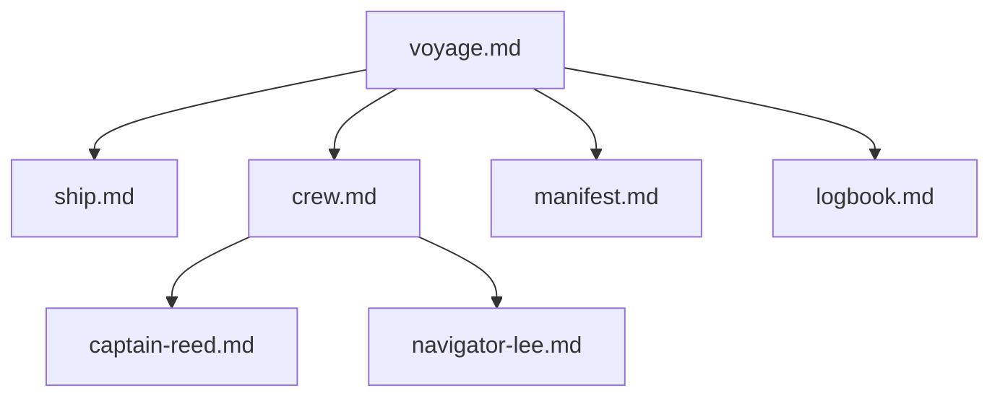

# Yurtle — Markdown that becomes a knowledge graph

> **Status (2026-06):** the spec is current (v2.0, Y0–Y6 layer model) and papers 101/117
> cite this repo. In the NuSy runtime, knowledge storage moved to Arrow tables in V14 —
> the Y-layer model defined here carries forward unchanged into the V19 Arrow Memory.

**Yurtle** = the simplest way to make every `.md` file in a folder part of a real, queryable knowledge graph.

Just add a YAML or RDF/Turtle block at the top of any Markdown file. That's it.

```yaml
---
yurtle: v2.0
id: nautical/voyage
type: voyage
title: The Crossing of the Western Sea
relates-to:
  - nautical/ship
  - nautical/crew
nugget: A three-month voyage to chart the uncharted archipelago
---
```

No plugins. No database. Works with Obsidian, Logseq, plain Git, or any AI memory system.

## What's New in v2.0

**Y-Layer Specification** — A 7-layer model for AI beings to organize knowledge:

| Layer | Purpose | Example |
|-------|---------|---------|
| Y0 | Raw prose | Source documents |
| Y1 | Semantic entities | Wikipedia-like pages |
| Y2 | Reasoning rules | Ontology, inference |
| Y3 | Experience | Conversations, actions |
| Y4 | Journal | Opinions, reflections |
| Y5 | Procedural | Workflows, skills |
| Y6 | Metacognitive | Self-awareness |

**See:** [y-layers-spec.md](y-layers-spec.md) for the full specification.

---

## The Three-Layer Semantic Model

Yurtle pages express relationships through three complementary layers:

| Layer | Where | Syntax | Purpose |
|-------|-------|--------|---------|
| **Frontmatter** | Top of file | `---` YAML `---` | Document metadata |
| **Content** | Body | Markdown + `[[links]]` | Human prose |
| **Yurtle Blocks** | Anywhere | ` ```yurtle ``` ` | Inline structured data |

This is the **"graph anywhere"** principle — relationships declared where they make sense.

---

## Layer 1: Frontmatter

```yaml
---
yurtle: v1.3
id: unique/uri/like/this
type: note | person | voyage | ship | project | ...
title: Human Readable Name
status: draft | active | complete
topics: [list, of, tags]
relates-to: [other/id, another/id]
nugget: One-sentence essence for search
created: 2025-12-01
---
```

### Hierarchy & Discovery

```yaml
path: folder/location
index:
  discoverable: true
  parent: parent-id
  children:
    - child-id-1
    - child-id-2
```

### Evolution & Domain

```yaml
domain: [nautical, logistics]
evolves:
  - previous-id
  score: 0.91
  reason: Added new properties
version: 1.3.0
```

---

## Layer 2: Content Body

Standard markdown with wiki-style links:

```markdown
The [[nautical/ship|Windchaser]] departed at dawn.
Captain [[nautical/crew-captain-reed|Reed]] took the helm.
```

LLMs can also extract relationships from prose:
- "The ship **depends on** a full crew" → `depends-on: crew`
- "This voyage **builds upon** the 1851 expedition" → `builds-upon: 1851-expedition`

---

## Layer 3: Yurtle Blocks

Structured data anywhere in your document, using familiar code fence syntax:

```markdown
# Windchaser

Built in Aberdeen, copper-sheathed, Baltimore clipper lines.

` ` `yurtle
ship:
  title: Windchaser
  built: 1852
  length: 62m
  status: seaworthy
  part-of: voyage
  crewed-by: crew
  commanded-by: crew-captain-reed
` ` `

She has outrun typhoons and carried tea from Canton in 79 days.
```

*(Remove spaces in fence — shown for display)*

### Same Syntax as Frontmatter

Yurtle blocks use **the same `key: value` syntax** as frontmatter:

```yurtle
ship:
  title: Windchaser
  built: 1852
  part-of: voyage

crew:
  size: 20
  morale: excellent
```

### Multiple Subjects

Define multiple nodes in one block:

```yurtle
captain:
  name: Elias Reed
  role: Master & Commander
  commands: ship

navigator:
  name: Mei-Xing Lee
  role: Navigator
  reports-to: captain
```

### Optional Base Namespace

For larger projects, set a base path:

```yurtle
@base nautical-project/

ship:
  title: Windchaser
  part-of: voyage

crew:
  size: 20
```

All IDs resolve relative to `nautical-project/`.

---

## Why This Design?

### Files Are the Interface

- State lives in files, not databases
- Git tracks all changes
- LLMs read files directly — no query language

### Graph Anywhere

Declare relationships where they make sense:
- **Document-level** → Frontmatter
- **In prose** → Wiki links
- **Structured mid-page** → Yurtle blocks

### LLM-Native

```
User: What ships are in the fleet?

LLM: *reads voyage.md frontmatter*
     *finds relates-to: [ship]*
     *reads ship.md, finds yurtle block*
     
     The Windchaser, a 62m clipper built in 1852.
```

No query language. Just markdown.

---

## Examples

### The Windchaser Project (Nautical)

**See →** [`examples/nautical-project/`](examples/nautical-project/)

A complete knowledge graph: voyage, ship, crew, manifest, logbook.


```mermaid
graph TD
  V[voyage.md] --> S[ship.md]
  V --> C[crew.md]
  V --> M[manifest.md]
  V --> L[logbook.md]
  C --> CR[captain-reed.md]
  C --> NL[navigator-lee.md]
```

**Demonstrates:** YAML frontmatter, parent/children hierarchy, yurtle blocks

---

### Laboratory Tests (Medical/Scientific)

**See →** [`examples/lab-tests/`](examples/lab-tests/)

Medical laboratory tests with LOINC codes, reference ranges, and clinical interpretations.

| File | Description | LOINC Code |
|------|-------------|------------|
| `complete-blood-count.md` | CBC panel with 12 components | 58410-2 |
| `hemoglobin-a1c.md` | Diabetes monitoring marker | 4548-4 |
| `lipid-panel.md` | Cholesterol and triglycerides | 57698-3 |
| `basic-metabolic-panel.md` | BMP with electrolytes | 51990-0 |

**Demonstrates:** Turtle frontmatter with full RDF, medical vocabularies (LOINC, SNOMED), yurtle blocks for test components

```markdown
---
@prefix lab: <https://yurtle.dev/lab/> .
@prefix loinc: <https://loinc.org/> .

<urn:lab:hemoglobin-a1c> a lab:LaboratoryTest ;
    lab:loincCode "4548-4" ;
    lab:referenceRangeNormal "< 5.7%" ;
    med:clinicalUse "Diabetes monitoring" .
---

# Hemoglobin A1c (HbA1c)

The HbA1c test reflects average blood glucose over 2-3 months...

` ` `yurtle
interpretation:
  normal: "< 5.7%"
  prediabetes: "5.7% - 6.4%"
  diabetes: ">= 6.5%"
` ` `
```

---

## Implementations

### Python: yurtle-rdflib

**[yurtle-rdflib](https://github.com/hankh95/yurtle-rdflib)** — RDFlib plugin for reading and writing Yurtle files.

```bash
pip install yurtle-rdflib
```

```python
from rdflib import Graph
import yurtle_rdflib

# Parse Yurtle files
graph = Graph()
graph.parse("voyage.md", format="yurtle")

# Load entire workspace
graph = yurtle_rdflib.load_workspace("nautical-project/")

# Query with SPARQL
results = graph.query("""
    SELECT ?ship ?title WHERE {
        ?ship a yurtle:Ship ;
              yurtle:title ?title .
    }
""")

# Live bidirectional sync
graph = yurtle_rdflib.create_live_graph("workspace/", auto_flush=True)
graph.add((subject, predicate, object))  # Persists immediately
```

**Features:**
- Parser: `graph.parse(format="yurtle")` for Turtle/YAML frontmatter
- Serializer: `graph.serialize(format="yurtle")` with markdown preservation
- Store: Bidirectional sync between graph and filesystem
- 55+ tests, Python 3.9-3.13 support

---

## Version History

| Version | Date | Changes |
|---------|------|---------|
| **v2.0** | Feb 2026 | Y-layer specification (7 layers: Y0-Y6) for AI beings |
| v1.3 | Dec 2025 | Yurtle blocks with code fence syntax |
| v1.2 | Dec 2025 | Three-layer model, infoboxes |
| v1.1 | Dec 2025 | Hierarchy (index, parent, children) |
| v1.0 | Nov 2025 | Initial release |

---

MIT licensed · Fork, extend, build your own fleet.

*"I'm Yurtle the Turtle! Oh, marvelous me! For I am the ruler of all that I see!"*
